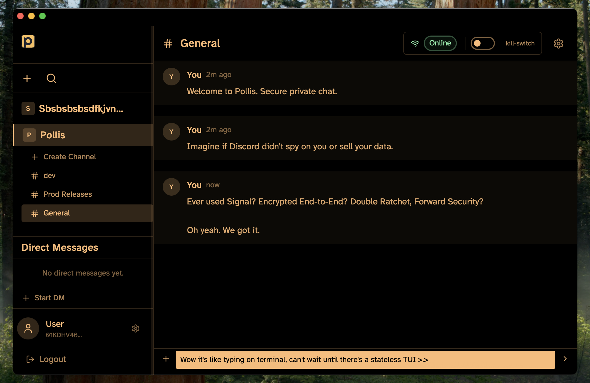

# Pollis

A desktop messaging app with end-to-end encryption. Think Slack, but nobody (including me) can read your messages. Built with Wails so it's a native app on macOS/Linux/Windows with a Go backend and React frontend.



## How it works

The desktop app runs locally with a Wails frontend (React/TypeScript) talking to a Go backend. Messages are encrypted using the Signal protocol before they leave your machine. There's a gRPC server for coordinating connections and signaling, but it never sees unencrypted content.

**Stack:**
- Desktop: Wails v2 (Go + React)
- Local storage: libSQL/SQLite
- Server: gRPC for signaling
- Remote DB: Turso (libSQL)

## Getting Started

### What you need

**Everyone needs:**
- Go 1.24+
- Node.js 18+
- pnpm 10.25+
- `protoc` (Protocol Buffers compiler)
- protoc plugins:
  ```bash
  go install google.golang.org/protobuf/cmd/protoc-gen-go@latest
  go install google.golang.org/grpc/cmd/protoc-gen-go-grpc@latest
  ```

**macOS:**
```bash
go install github.com/wailsapp/wails/v2/cmd/wails@latest
# or if you prefer homebrew for protoc:
brew install protobuf
```

**Linux:**
```bash
go install github.com/wailsapp/wails/v2/cmd/wails@latest
# you'll also need some system deps, check: https://wails.io/docs/gettingstarted/installation#linux
```

### Setup

```bash
# install deps
pnpm install

# generate protobuf code
pnpm proto

# set up your database (you need this)
cp .env.example .env.local
# edit .env.local and add your Turso credentials (free at https://turso.tech)
```

### Running it

```bash
# run everything (server + desktop app)
pnpm dev

# just the frontend in a browser
pnpm dev:frontend

# just the server
pnpm dev:server
```

### Building

```bash
# build for whatever platform you're on
pnpm build:app

# or use make for specific platforms
make build-macos    # universal binary (Intel + Apple Silicon)
make build-linux    # amd64
make build-windows  # amd64
```

## Project layout

```
frontend/    # React app
server/      # gRPC server
internal/    # Desktop app Go code
pkg/proto/   # Shared protobuf definitions
```
