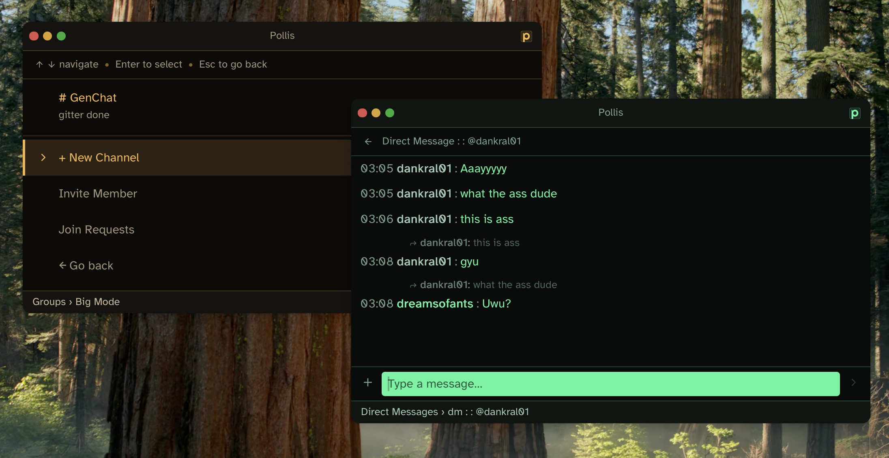

# Pollis

A desktop messaging app with end-to-end encryption. Think Slack, but nobody — including the people running it — can read your messages. Built with Tauri 2, so it's a native app on macOS, Linux, and Windows with a Rust backend and React frontend.



## How it works

Messages are encrypted on your device using MLS (Messaging Layer Security) before they ever leave your machine. The backend connects directly to Turso (libSQL) for group and channel metadata. There is no intermediate server — the Tauri app is the backend. Encrypted message envelopes are stored remotely for offline delivery, and decrypted message history lives in a local SQLite database encrypted at rest.

**Stack**
- **Desktop**: Tauri 2 (Rust + React/TypeScript)
- **Encryption**: MLS (Messaging Layer Security) for group channel encryption, AES-256-GCM
- **Remote DB**: Turso (libSQL) — direct from the app, no middleman
- **Local DB**: SQLite via SQLCipher (encrypted at rest)
- **Auth**: Email OTP, session stored in the OS keystore
- **Real-time**: LiveKit (WebRTC for voice and video calls)
- **File storage**: Cloudflare R2

## Security model

Message content and file attachments are encrypted on your device before they ever leave it. The server stores ciphertext it can never read — your messages and files are inaccessible to anyone operating the infrastructure. Private keys never leave the device. Session tokens live in the OS keystore (macOS Keychain, Windows Credential Manager, Linux Secret Service), not on disk.

Forward secrecy is provided by MLS's key schedule: each epoch advance rotates the group key material, and each message uses a unique derived key so compromising one doesn't expose past or future messages.

## Releases

Builds for macOS (Universal), Windows, and Linux are published automatically on every version tag via GitHub Actions. Binaries are uploaded to Cloudflare R2, and a `latest.json` manifest is written alongside them. The marketing site at [pollis.com](https://pollis.com) reads that manifest on load to always show the current download links.


## Getting started

### Prerequisites

- Node.js 18+
- pnpm 10.25+
- Rust (stable, via rustup)
- Tauri v2 system dependencies — see [tauri.app/start/prerequisites](https://tauri.app/start/prerequisites/)
- Access to Doppler for secrets (ask the project owner)

### Setup

```bash
pnpm install          # Install JS dependencies
```

### Running

```bash
pnpm dev              # Full desktop app (Rust + React)
pnpm dev:frontend     # Frontend only in browser (no Tauri commands)
```

### Skipping email OTP in development

Add `DEV_OTP=000000` to `.env.development`. With this set, hitting "Continue" on the login screen skips the Resend email call and stores a hash of `000000` as the valid code — type it in the OTP field to sign in. The session persists to the OS keystore so you only need to do this once per fresh install.

### Testing with two users

```bash
# Terminal 1 — user A
pnpm dev

# Terminal 2 — user B
POLLIS_DATA_DIR=/tmp/pollis2 pnpm dev
```

Both instances hit the same Turso database, so messages appear in real time across windows via LiveKit.

### Building

```bash
pnpm build            # Current platform
pnpm build:macos      # Universal binary (Intel + Apple Silicon)
pnpm build:linux      # amd64 AppImage
pnpm build:windows    # amd64 NSIS installer
```

## Project layout

```
src-tauri/   # Rust backend — Tauri commands, DB, MLS encryption, auth
frontend/    # React app — Vite, TypeScript, TailwindCSS
website/     # Static marketing site — plain HTML/CSS/JS, deployed to Cloudflare Pages
```

## What's coming

- **Broader platform availability** — currently open pre-alpha; working toward a stable public release
