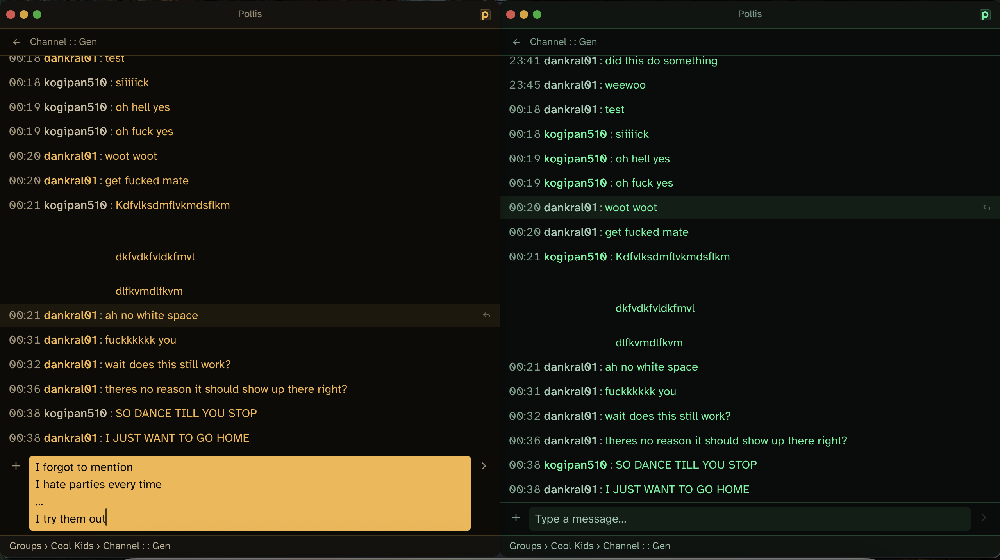

# Pollis

A desktop messaging app with end-to-end encryption. Think Slack, but nobody (including me) can read your messages. Built with Tauri 2 — native app on macOS/Linux/Windows with a Rust backend and React frontend.



## How it works

The desktop app runs locally with a React frontend talking to a Rust (Tauri) backend. Messages are encrypted on-device using the Signal protocol before they leave your machine. The backend connects directly to Turso (libSQL) for group/channel metadata, and stores encrypted messages in a local SQLite database.

**Stack:**
- Desktop: Tauri 2 (Rust + React/TypeScript)
- Local storage: SQLite (encrypted at rest via SQLCipher) via rusqlite
- Remote DB: Turso (libSQL) — direct connection, no middleman server
- Auth: Email OTP, session in OS keystore
- Encryption: Signal Protocol (Ed25519, X25519, HKDF, AES-256-GCM, Double Ratchet)
- Real-time: LiveKit (WebRTC data channels for message delivery pings)

## Security model

Pollis is designed so that the server — and anyone who operates it — cannot read your messages.

### What the server sees

Turso (the remote database) stores:
- User accounts, group/channel metadata, group membership
- Public keys (Ed25519 identity keys, X25519 identity keys, signed prekeys, one-time prekeys)
- Encrypted message envelopes (ciphertext only — opaque binary blobs)
- Sender key distributions (encrypted per-recipient with X3DH)

Turso **never** sees: message plaintext, private keys, or your local database contents.

### Encryption layers

**Message encryption — Signal Protocol sender keys**

Each user maintains a sender key per channel: a chain ID, a chain key, and an iteration counter. To send a message:

1. The sender key chain advances via HMAC-SHA256 to derive a one-time message key.
2. The message is encrypted with AES-256-GCM using that key.
3. The ciphertext is written to Turso as a `message_envelope` row.

Recipients decrypt by advancing their local copy of the sender's chain to the correct iteration.

**Sender key distribution — X3DH**

When a user sends their first message to a channel (or after a key rotation), they distribute their sender key state to each group member individually. Each distribution is encrypted with a fresh ephemeral key using X3DH (X25519 Diffie-Hellman + HKDF-SHA256 → AES-256-GCM). Only the intended recipient's private keys can decrypt it.

**Local database — SQLCipher**

The local SQLite database (which stores decrypted message content, Signal session state, and prekeys) is encrypted at rest using SQLCipher with a 256-bit AES key. That key is generated on first launch and stored in the OS keystore (macOS Keychain, Windows Credential Manager, Linux Secret Service). An attacker with filesystem access to the database file cannot read it without also compromising the OS keystore.

**Session tokens**

Auth session tokens are stored exclusively in the OS keystore — never on disk as plaintext.

### What this means in practice

- Pollis operators cannot read your messages. The server only sees ciphertext.
- A Turso database breach exposes metadata (who is in which group) and ciphertext, but not message content.
- A compromised local machine (filesystem access only) cannot read your message history without also accessing the OS keystore.
- Forward secrecy: each message uses a unique derived key. Compromising a chain key at iteration N does not expose messages sent before N.

## Getting Started

### What you need

- Node.js 18+
- pnpm 10.25+
- Rust (stable, via rustup)
- Tauri v2 system dependencies — see [tauri.app/start/prerequisites](https://tauri.app/start/prerequisites/)
- An age key for decrypting secrets (ask the project owner)

### Setup

```bash
# Install JS dependencies
pnpm install

# Decrypt secrets → .env.development
pnpm secrets:decrypt
```

### Running

```bash
# Run the desktop app
pnpm dev

# Run frontend in browser only (no Tauri commands available)
pnpm dev:frontend
```

### Testing with two users

Use `POLLIS_DATA_DIR` to give the second instance its own local SQLite database and session:

```bash
# Terminal 1 — user A
pnpm dev

# Terminal 2 — user B
POLLIS_DATA_DIR=/tmp/pollis2 pnpm dev
```

Sign into different accounts in each window. Both hit the same Turso database, so messages sent in one instance appear in real time in the other via LiveKit data channels.

### Building

```bash
# Build for current platform
pnpm build

# Platform-specific
pnpm build:linux    # amd64
pnpm build:macos    # universal binary (Intel + Apple Silicon)
pnpm build:windows  # amd64
```

## Project layout

```
src-tauri/   # Rust backend (Tauri commands, DB, crypto)
frontend/    # React app (Vite, TypeScript, TailwindCSS)
website/     # Next.js marketing site
```
