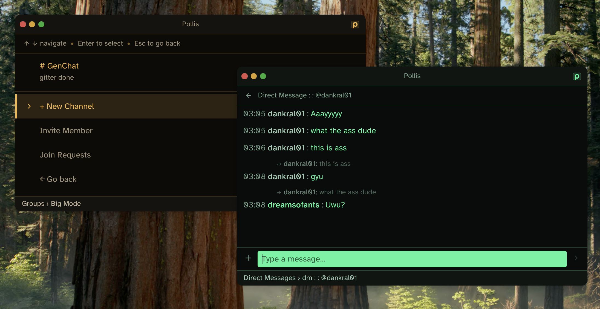
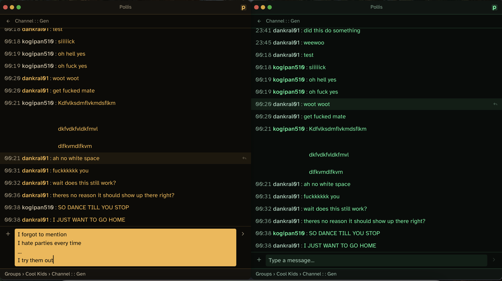

# Pollis

A desktop messaging app with end-to-end encryption. Think Slack, but nobody —
including the people running it — can read your messages. Built as a Tauri app on
macOS, Linux, and Windows, with a React frontend and a native Rust backend — the
heavy lifting (crypto, MLS state, voice/screenshare) runs in Rust, not in the
renderer.

**Download:** [pollis.com](https://pollis.com) always links the current signed
build for each platform.
**Run or verify it yourself:** you don't have to take the privacy claims on faith
— see [Verify it yourself](#verify-it-yourself) below.
**Want to contribute?** Build/run/test instructions live in
[CONTRIBUTING.md](CONTRIBUTING.md).



## How it works

Messages are encrypted on your device using MLS (Messaging Layer Security) before
they ever leave your machine. The Rust backend connects directly to Turso
(libSQL) to read group and channel metadata. Every write goes through the
Delivery Service, an in-repo, self-hostable axum server that serializes MLS
commits; neither it nor the database can read plaintext. Encrypted message envelopes are stored remotely for
offline delivery, and decrypted message history lives in a local SQLite database
encrypted at rest.

**Stack**
- **Desktop shell**: Tauri 2 (Rust host + system WebView renderer)
- **Frontend**: React 19, TypeScript, Vite, TailwindCSS
- **Backend**: Rust split into `pollis-core` (reusable crate; also consumed by
  mobile via uniffi) and `src-tauri` (the Tauri host that exposes `pollis-core`
  to the renderer via `invoke`).
- **Encryption**: MLS for group channel encryption (ChaCha20-Poly1305 AEAD); AES-256-GCM for attachments and cached media. Voice channels
  are end-to-end encrypted too — per-frame AES-128-GCM via libwebrtc's
  `FrameCryptor`, keyed from the MLS group's exporter secret, so the LiveKit SFU
  forwards ciphertext only.
- **Remote DB**: Turso (libSQL) — reached only by the Delivery Service; the client holds no database credential and every read and write is a signed `POST /v1/…`
- **Local DB**: SQLite via rusqlite (encrypted at rest, key in the device keystore)
- **Auth**: Email OTP, session stored in the device keystore
- **Real-time**: LiveKit (voice calls via Rust `livekit` crate, real-time presence)
- **File storage**: Cloudflare R2

## Security model

Message content, file attachments, and voice audio are encrypted on your device
before they ever leave it. The server stores ciphertext it can never read — your
messages, files, and voice calls are inaccessible to anyone operating the
infrastructure. Private keys never leave the device. Session tokens live in the OS
keychain (macOS Keychain, Windows Credential Manager, Linux Secret Service); on
a host with no keychain — a server over SSH — they go to a file whose bytes are
encrypted under a key bound to that machine, never to plaintext.

- **What the server can never see:** message text, file contents, and voice audio.
  It only ever holds ciphertext and public metadata (who is in a channel, when
  commits happened).
- **Forward secrecy:** MLS's key schedule rotates the group key on every epoch
  advance, and each message uses a unique derived key, so compromising one key
  doesn't expose past or future messages. Each device additionally rotates its own
  leaf key on join and roughly weekly thereafter (launch-driven, not a timer), so
  a compromised device heals rather than staying readable.
- **Post-quantum:** there is exactly one MLS cipher suite and it is the
  post-quantum one — the classical suite Pollis ran alongside it during the
  rollout has been retired. Group key exchange is hybrid: X25519 **and**
  ML-KEM-768 (FIPS 203) combined via X-Wing, so recorded traffic stays sealed
  unless an attacker breaks *both*. Signatures are ML-DSA-44 (FIPS 204), so a
  signed statement about history stays checkable long after a quantum computer
  exists.
- **Voice:** a second encryption layer sits on top of the standard DTLS-SRTP link
  to LiveKit. Each Opus frame is AES-128-GCM encrypted by libwebrtc's
  `FrameCryptor` before SRTP, keyed by a 32-byte secret derived from the channel's
  MLS group via `MlsGroup::export_secret`; the key rotates on every MLS epoch. The
  SFU routes packets it cannot decode. The design matches what `livekit-client`
  exposes as `setupE2EE` and what Discord ships as DAVE.
- **Tamper-evident history:** every MLS commit is published to an append-only
  **transparency log**, so the server can't quietly fork, roll back, or rewrite a
  conversation's history without detection.

**Honest scope.** Pollis hides message *content*, not the *fact* that you are
communicating. The server and network still see connection metadata (IP address,
timing, which accounts are in a channel). There is no sender anonymity. IP
hiding is **off by default**: an optional closed-overlay relay (v0, single-hop)
is built into the app and can be switched on in Preferences → "Network privacy
(relay)", but unless you turn it on every connection goes direct
([docs/relay-overlay-design.md](docs/relay-overlay-design.md) §13). Even when
on, it hides your IP from our servers only — it is not anonymity, it does not
hide the social graph, and it is not part of the E2EE guarantee. Key exchange *is*
post-quantum hybrid ([docs/pq-hybrid-mls-design.md](docs/pq-hybrid-mls-design.md)),
but traffic is only ever as strong as the suite it was sealed under at the time:
moving a group onto a newer suite does not re-seal what came before it — nothing
upgrades retroactively. The full,
caveated threat model is in
[docs/security-whitepaper.md](docs/security-whitepaper.md); a plain-language
version is [docs/security-simple.md](docs/security-simple.md).

## Verify it yourself

The point of Pollis is that you don't have to trust the operator — you can check
the claims. Three independent, credential-free ways to do that, in increasing
depth:

### 1. Audit the transparency log with the `pollis-verify` CLI

Pollis publishes an append-only Merkle log (RFC 6962 / RFC 9162, the same
construction Certificate Transparency uses) covering **three** trees: every MLS
commit, every account identity-key version, and every released binary. The
verifier trusts **only** the log's published public key — not the server, the
database, or the host serving the files. If a single byte is tampered with, a
signature or proof check fails and the tool exits non-zero.

Pinned public key (ML-DSA-44, 1312 bytes), so a signed statement about history
stays checkable on a horizon no single message needs:

```
56ab128f3f10107382802e69d3de8659d0127c711feb9c849f5b213c6f2d0af3b5fe41f581b202b385906fc42e4421747e84939054d160c551536131e41508a82b1f3ff0a07bcc4cee5e2eae8e85155d5c9e0dbc6e7683811649fb9e3b1f18c7ed070dbf61f2a058915b33f8ad3edcd135dd18770053e5ac971b13d17d95e16e98f47a852d600c47cbc0349354af2898803cfec7112660076d20027cb67870e18fb25ee327a36743fa812ccf93ba0769ddbd3d42ab40849ac8c98357b64eaf1ffc242abb12fddef4d8cdfa02448b4d99546b448e589657f898a47c6f30ddd88edd3f4456470e0a151e5fd601750c8b0489d3471897cfa78e0d7a00d938dfe876ef243117c972e041fdb00aa7af30d34184153cfd7b1e3b481dc562bbfc82bc20fe8ac4d9845f41de49fc33b6f94494df7088b06c7cb9ae35db86ac0fd293ca403046cec46ca9b12c755670d3d9b14c300b11ec292cd5e37d9f9e5e5d1729222a33bf1e13440f44dbf1b4d4104c612db4e269760868be5ff99f9ed269625fa4f39e21713a14293285e95f8a8e8cecd9db8e6a70c36340280322eab3490270ac640f706a23e81d79111dead641eaf7b926582ed0b0422f9addc0091d731a4fe1b9079be8bd75df23f5f9bf287beab7f67f763e04f0245bf9c705136d04eb8391fb4b4f12bfba44ae49bb6f32ddb0d539e59cd0159120b2fb1718f57e12a846638dbe0b650bfcd5a6cc74cd315b49136ea4e13d431a7f3a4c38fc783a82ca2b4c44a2f379c8aa9704d4639de3f94466662c97fbbd834db97a90405c382b5039803f4e4ed5c6b57487c8d23ad9e4d319df3466c49ef1e1cef526ddad1db5fa14f3b067b40580e068582dc428e21dbdc3df848e8e00fe1181f8e0d1409ab9a8757aef008b67191f4368f37cbd587ff65acdf07adbb989d09cc3318e346ca71c029557f2c523c204defab472b3dcb09bfbb95d5d1665a360a00faeb09b660f13fdc00f7b53fbfeaa58f87a208ad4551bcbe4307bf4d8451e027f4cc33cd55700016795c3164b1bc90d9dd1737b49d2e9e4b190128d2e62a44a80c1375c616aa2871ae7ad4a914102551380a8f8edb68c2df02bdf52607a7432ea7026f6a1efcdb37ecc11ecf1623ec6979e5d65c2812a997121010cd5fd9a98b9ed34edc17b667bfd37ef2be6dfe67fbdde03fa95bb80d0e1c7336263042ef44c4f9d28f1bf959bdc24c09cf8269378705022ff476fce91dbba6c8ffec00b27572eaa4835b59948d7a625ccc84ff4ac062176f4972f5131a961b17c7ff0010d2f2f3f8c12b7bf05fb9771d64a24fdab058f4bf3a155ade6a496b9a09d43a7673b5d8fb6519e01bf911ca78cc23f95943f63db72883d522fe24d4b7c7a26c7fd43b4f6f7496acf9ea2cab2e3cd6fc274964b576084c820bae79dbaa331d11751ec718660cd8e7847b7bacf31180803f681fb349b96338c98c791f74bc95e0d37b2810632159bc3175fed2e16038d45d35e4628250e8c9fb66c5bb2238f6456901f657e9655d3d5a09ff4952a0b9eb9c614f78c27626a136ef281f7099f68e898628530ef690851c179ef6a02448d498e49b2c362c839832100f4a9bf4abf17d496c71bfb5263da345d952b275f04707b31b9f6575da6dd2be799b90cc615f52ec32b4833a7e619d7f34f91f16edc38bc0a869c7211473f3ab90255446e0b7efbb2b97e8111d43b039ec0469b020f38925aad61e229836c96fad5bf3c3cad8f2c1c8b56cd819e8972d108dbfa8cd518177feaa7f4e0b547584a9a5d39ad4f1e8010cfead998ec18991cb89031a11c03cbd1ee7e0a1436da10ef154db13d4850c687c0a668215c9c8b7b1c
```

`pollis-verify` trusts only this key. A served key that differs is treated as a
hostile host, not as a new key — any key can sign a self-consistent forged tree.

Grab a prebuilt `pollis-verify` from the
[Releases](https://github.com/actuallydan/pollis/releases) page (tags
`pollis-verify-v*`; the pinned key is printed in the release body) or build it
from source with `cargo build -p verifiable-log-serve --release`. Then:

```bash
# Verify the WHOLE log end to end — every STH signature, every entry replay,
# every inclusion + consistency proof, no equivocation across heads.
pollis-verify remote https://verify.pollis.com

# Verify one conversation's commit chain is provably included and fork-free.
pollis-verify group   https://verify.pollis.com <conversation-id>

# Verify one user's account-key history is append-only (no silent key swap).
pollis-verify account https://verify.pollis.com <user-id>

# Verify a released build's logged hashes match a given release tag.
pollis-verify release https://verify.pollis.com <tag>
```

A passing run prints a `PASS` line per check and exits `0`; any failure prints
`FAIL` and exits non-zero — and that exit code is computed from the signature and
the proofs, not from anything the server told you to believe. The desktop app runs
the *same* `account` verifier internally to self-audit its own identity key, so
the client and an independent auditor reach an identical verdict.

Prefer to trust nothing on the network during verification? Download the signed
bundle once and check it fully offline with `monitor verify <bundle.json>`
(`cargo build -p verifiable-log --release`). The step-by-step walkthrough,
including sample output for every subcommand, is
[docs/verify-transparency-log.md](docs/verify-transparency-log.md).

### 2. Read the verification API directly

The log is a plain, immutable, unauthenticated static read API under
`https://verify.pollis.com/v1/` — you can `curl` it and check the math with your
own tooling. The verifier above is just a convenient client for these bytes.

| Path | What it is |
|---|---|
| `/v1/public_key.json` | the log's ML-DSA-44 public key (1312 bytes, hex) |
| `/v1/sth/latest.json` | newest Signed Tree Head (`tree_size`, `root_hash`, `timestamp`, signature) |
| `/v1/sth/<tree_size>.json` | the immutable STH at that size |
| `/v1/entries.json` · `/v1/entries/<i>.json` | the full ordered log, and each leaf |
| `/v1/proof/inclusion/<size>/<leaf>.json` | inclusion proof |
| `/v1/proof/consistency/<a>-<b>.json` | append-only consistency proof between two heads |

The account-key and binaries trees mirror this exact layout under
`/v1/account-keys/...` and `/v1/binaries/...`, each domain-separated so an STH
minted for one tree can't be replayed as another's. The browser explorer at
[pollis.com/transparency](https://pollis.com/transparency) is a convenience
front-end over the same data — it is exactly as trustworthy as the server hosting
it, which is why the trustworthy path is running the CLI yourself. Full API
reference: [docs/transparency.md](docs/transparency.md).

### 3. Read the publish-and-self-audit run logs

The log isn't just published — every publish **re-verifies what was actually
served** and runs an across-run equivocation tripwire, in public CI. The
[`transparency-publish`](https://github.com/actuallydan/pollis/actions/workflows/transparency-publish.yml)
workflow builds the signed bundles, syncs them to R2, then runs
`pollis-verify remote` against the live `verify.pollis.com` and compares the new
heads against a cached copy of the previous run's — so an equivocating or
rolled-back head trips the build. Open any run on the Actions tab and read the
"final verify" step: a green run is a signed, timestamped, public record that the
served log verified against its own pinned key. Release builds are logged the same
way by the desktop-release pipeline, which appends each artifact's hashes to the
binaries tree.

### 4. Run the whole thing yourself

The repo is public and the app runs entirely on infrastructure you control.
[docs/run-it-yourself.md](docs/run-it-yourself.md) walks through standing up your
own Turso DB, LiveKit SFU, and R2 bucket and running the real client end to end —
so you can confirm what does and doesn't leave your machine, with a network
inspector if you like.

**A note on verifiable builds (honest status).** The binaries tree proves that the
release artifacts you downloaded are byte-for-byte the ones the pipeline logged and
signed. Beyond that binding:

- **Linux is reproducible, and that is demonstrated rather than asserted.** At
  `v1.8.4` an independent rebuild from public source matched the payload hash in the
  transparency log exactly (`1a4213a1…`), verified against the pinned log key alone.
  The rebuilder now runs automatically after every release, so the property is
  continuously checked. One bound worth stating: it covers the **Linux AppImage
  payload**. Reproduction is not tied to our filesystem layout — Rust *and* C/C++
  build paths are remapped, and the release fails if the finished binary embeds an
  absolute build path.
- **macOS and Windows payload digests are recomputable from the artifact you
  downloaded** — the shipped bundle with the platform's signing material normalized
  back out — but they are **not** yet rebuilt-from-source, so they are a weaker claim
  than Linux.
- **Shipped:** cosign/SLSA build provenance anchored in public Rekor, and an in-app
  "verify this build" check.
- Install-time integrity still additionally rests on platform code-signing (Apple
  Developer ID + notarization, Azure Trusted Signing) — transparency is *added to*,
  not a replacement for, signing.

Details and the full residual list:
[docs/reproducible-builds-residuals.md](docs/reproducible-builds-residuals.md),
[docs/verifiable-builds-design.md](docs/verifiable-builds-design.md).

## Releases

Builds for macOS, Windows, and Linux are published automatically on every version
tag via the Tauri release workflow. Tauri's bundler produces the platform
installers and the `update-{{bundle_type}}.json` manifests that the in-app updater
reads at runtime from `cdn.pollis.com`, so the marketing site at
[pollis.com](https://pollis.com) always shows the current download links.
Auto-update trust is rooted in the OS code signature on each installer — Apple
Developer ID + notarization on macOS, Azure Trusted Signing on Windows — and each
released artifact is additionally logged to the binaries transparency tree (see
[Verify it yourself](#verify-it-yourself)).



## Contributing

Build, run, and test instructions — plus the conventions changes are expected to
follow — are in **[CONTRIBUTING.md](CONTRIBUTING.md)**. The architecture overview
is in [CLAUDE.md](CLAUDE.md) and [ARCHITECTURE.md](ARCHITECTURE.md); subsystem docs
are in [`.codesight/wiki/`](.codesight/wiki/index.md).

## What this repo produces

This is a monorepo. Despite the desktop app being the headline, it ships a number
of distinct, independently-deployable artifacts:

| Output | Lives in | What it is |
|---|---|---|
| **Desktop app** | `src-tauri/` + `frontend/` | The Tauri client, bundled for macOS / Windows / Linux |
| **Mobile app** | `mobile/` | React Native / Expo client for iOS + Android (consumes `pollis-core` via uniffi; in development) |
| **MLS Delivery Service** | `pollis-delivery/` | Dockerized axum service — the sole writer that serializes MLS commits server-side (`api.pollis.com`); crypto stays client-side |
| **LiveKit stack** | `livekit/` | docker-compose + nginx config for the self-hostable voice/screenshare SFU |
| **Transparency publisher** | `verifiable-log-serve/` | Dockerized builder/serve that publishes the signed append-only log to R2 (`verify.pollis.com`) |
| **Website** | `website/` | Static marketing + docs site (Cloudflare Pages), including the transparency explorer |
| **CLI tools** | `verifiable-log*/` | `pollis-verify` (public log verifier), plus the lower-level `monitor`, `builder`, and `serve` binaries |
| **AUR package** | `aur/` | `PKGBUILD` for Arch Linux distribution of the desktop app |
| **The transparency log itself** | _(scheduled output)_ | The daily signed Merkle log synced to R2 — the verifiable artifact the whole transparency system exists to produce |

The reusable backend (`pollis-core`) is the shared spine: the desktop host, the
mobile bindings, and the CLIs all build on it.

## Project layout

```
pollis-core/      # Reusable Rust backend — commands, DB, MLS encryption, auth (no shell dependency; also exposed to mobile via uniffi)
src-tauri/        # Tauri desktop host (current shell) — commands, tray, window lifecycle; exposes pollis-core via `invoke`
frontend/         # React app — Vite, TypeScript, TailwindCSS, runtime-host bridge at src/bridge/
mobile/           # React Native / Expo client (iOS + Android)
pollis-delivery/  # MLS Delivery Service — axum, sole writer that serializes commits server-side
verifiable-log*/  # Transparency log core, builder, serve, and the pollis-verify CLI
livekit/          # Self-host config for the LiveKit SFU (docker-compose + nginx)
website/          # Static marketing site — plain HTML/CSS/JS, deployed to Cloudflare Pages
```

## What's coming

- **Broader platform availability** — currently open pre-alpha; working toward a
  stable public release
- **Maturing the optional IP-hiding relay overlay** — v0 (single-hop) is built
  and opt-in today, off by default; multi-hop (v1) is not built. See the
  security docs above
