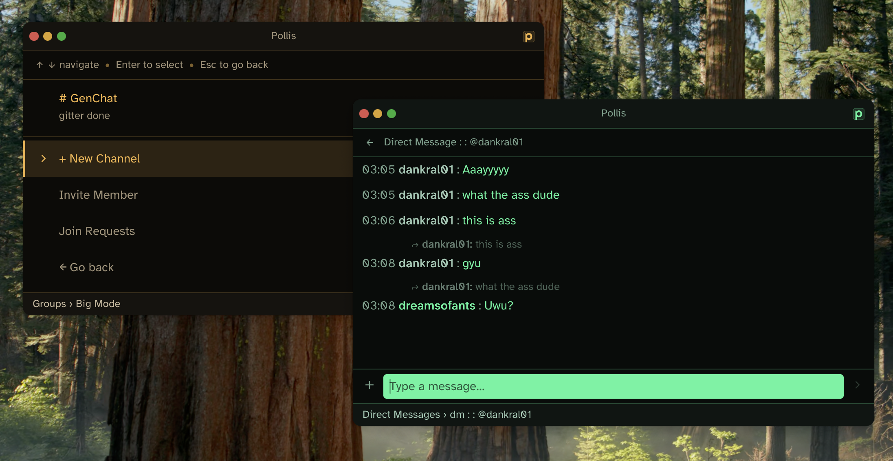
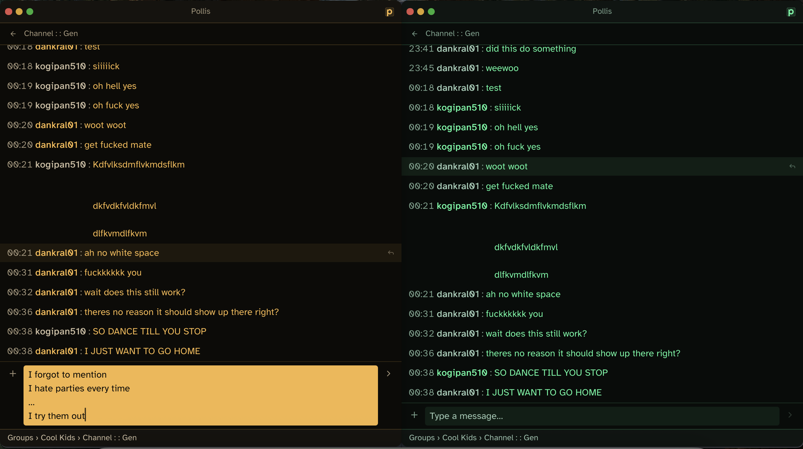

# Pollis

An end-to-end encrypted desktop messenger, organised like Slack: workspaces and
channels, where the people running the service cannot read your messages. It is a
Tauri app for macOS, Linux and Windows with a React frontend. Crypto, MLS state and
voice/screenshare run in Rust, not in the renderer.

- **Download:** [pollis.com](https://pollis.com) links the current signed build for
  each platform.
- **Check the privacy claims:** see [Verify it yourself](#verify-it-yourself).
- **Contribute:** build, run and test instructions are in
  [CONTRIBUTING.md](CONTRIBUTING.md).



## How it works

Messages are encrypted on your device with MLS (Messaging Layer Security) before
they leave it. The client holds no database credential: every remote read and write
is a signed request to the Delivery Service, an in-repo, self-hostable axum server
that also serializes MLS commits. Neither it nor the database (Turso) can read
plaintext. Encrypted envelopes are stored remotely for offline delivery; decrypted
history lives in a local SQLite database encrypted at rest.

**Stack**
- **Desktop shell**: Tauri 2 (Rust host + system WebView)
- **Frontend**: React 19, TypeScript, Vite, TailwindCSS
- **Backend**: Rust, split into `pollis-core` (reusable crate, also used by mobile
  via uniffi) and `src-tauri` (the Tauri host that exposes `pollis-core` to the
  renderer via `invoke`)
- **Encryption**: MLS for channels (ChaCha20-Poly1305 AEAD); AES-256-GCM for
  attachments and cached media; per-frame AES-128-GCM for voice (see below)
- **Remote DB**: Turso (libSQL), reached only by the Delivery Service; the client
  calls signed `POST /v1/…` endpoints
- **Local DB**: SQLite via rusqlite, encrypted at rest, key in the device keystore
- **Auth**: email OTP, session stored in the device keystore
- **Real-time**: LiveKit (voice via the Rust `livekit` crate, presence)
- **File storage**: Cloudflare R2

## Security model

Message text, file contents and voice audio are encrypted on your device. The
server stores only ciphertext and public metadata (who is in a channel, when
commits happened). Private keys never leave the device. Session tokens live in the
OS keychain (macOS Keychain, Windows Credential Manager, Linux Secret Service); on a
host with no keychain, such as a server over SSH, they go in a file encrypted under
a key bound to that machine, never in plaintext.

- **Forward secrecy and healing:** MLS derives a new group key every epoch and a
  unique key per message, so one compromised key does not expose past or future
  messages. Each device also rotates its own leaf key on join and about weekly after
  that (on launch, not on a timer), so a compromised device recovers.
- **Post-quantum:** Pollis has one MLS cipher suite, and it is post-quantum; the
  classical suite used during the rollout is retired. Key exchange is hybrid, X25519
  plus ML-KEM-768 (FIPS 203) combined with X-Wing, so recorded traffic stays sealed
  unless both are broken. Signatures are ML-DSA-44 (FIPS 204).
- **Voice:** on top of DTLS-SRTP to LiveKit, each Opus frame is encrypted with
  AES-128-GCM by libwebrtc's `FrameCryptor`, keyed by a 32-byte secret exported from
  the channel's MLS group (`MlsGroup::export_secret`) and rotated every epoch. The
  SFU forwards packets it cannot decrypt. This is the same design as
  `livekit-client`'s `setupE2EE` and Discord's DAVE.
- **Tamper-evident history:** every MLS commit is published to an append-only
  transparency log, so the server cannot fork, roll back or rewrite a conversation's
  history without detection.

**Limits.** Pollis hides message content, not the fact that you are communicating.
The server and network see connection metadata (IP address, timing, channel
membership), and there is no sender anonymity. An optional single-hop relay (v0)
that hides your IP from Pollis servers is built in but **off by default**; turn it on
in Preferences → "Network privacy (relay)"
([docs/relay-overlay-design.md](docs/relay-overlay-design.md) §13). It does not
provide anonymity, does not hide the social graph, and is not part of the E2EE
guarantee. Traffic is only as strong as the suite it was sealed under: moving a group
to a newer suite does not re-protect earlier traffic
([docs/pq-hybrid-mls-design.md](docs/pq-hybrid-mls-design.md)). The full threat
model is [docs/security-whitepaper.md](docs/security-whitepaper.md); a
plain-language version is [docs/security-simple.md](docs/security-simple.md).

## Verify it yourself

You can check these claims without trusting the operator, and without credentials.

### 1. Audit the transparency log with `pollis-verify`

Pollis publishes three append-only Merkle trees (RFC 6962 / RFC 9162, as in
Certificate Transparency): every MLS commit, every account identity-key version, and
every released binary. The verifier trusts only the log's public key, not the
server, the database or the file host. If any byte is altered, a signature or proof
check fails and the tool exits non-zero.

Pinned public key (ML-DSA-44, 1312 bytes):

```
56ab128f3f10107382802e69d3de8659d0127c711feb9c849f5b213c6f2d0af3b5fe41f581b202b385906fc42e4421747e84939054d160c551536131e41508a82b1f3ff0a07bcc4cee5e2eae8e85155d5c9e0dbc6e7683811649fb9e3b1f18c7ed070dbf61f2a058915b33f8ad3edcd135dd18770053e5ac971b13d17d95e16e98f47a852d600c47cbc0349354af2898803cfec7112660076d20027cb67870e18fb25ee327a36743fa812ccf93ba0769ddbd3d42ab40849ac8c98357b64eaf1ffc242abb12fddef4d8cdfa02448b4d99546b448e589657f898a47c6f30ddd88edd3f4456470e0a151e5fd601750c8b0489d3471897cfa78e0d7a00d938dfe876ef243117c972e041fdb00aa7af30d34184153cfd7b1e3b481dc562bbfc82bc20fe8ac4d9845f41de49fc33b6f94494df7088b06c7cb9ae35db86ac0fd293ca403046cec46ca9b12c755670d3d9b14c300b11ec292cd5e37d9f9e5e5d1729222a33bf1e13440f44dbf1b4d4104c612db4e269760868be5ff99f9ed269625fa4f39e21713a14293285e95f8a8e8cecd9db8e6a70c36340280322eab3490270ac640f706a23e81d79111dead641eaf7b926582ed0b0422f9addc0091d731a4fe1b9079be8bd75df23f5f9bf287beab7f67f763e04f0245bf9c705136d04eb8391fb4b4f12bfba44ae49bb6f32ddb0d539e59cd0159120b2fb1718f57e12a846638dbe0b650bfcd5a6cc74cd315b49136ea4e13d431a7f3a4c38fc783a82ca2b4c44a2f379c8aa9704d4639de3f94466662c97fbbd834db97a90405c382b5039803f4e4ed5c6b57487c8d23ad9e4d319df3466c49ef1e1cef526ddad1db5fa14f3b067b40580e068582dc428e21dbdc3df848e8e00fe1181f8e0d1409ab9a8757aef008b67191f4368f37cbd587ff65acdf07adbb989d09cc3318e346ca71c029557f2c523c204defab472b3dcb09bfbb95d5d1665a360a00faeb09b660f13fdc00f7b53fbfeaa58f87a208ad4551bcbe4307bf4d8451e027f4cc33cd55700016795c3164b1bc90d9dd1737b49d2e9e4b190128d2e62a44a80c1375c616aa2871ae7ad4a914102551380a8f8edb68c2df02bdf52607a7432ea7026f6a1efcdb37ecc11ecf1623ec6979e5d65c2812a997121010cd5fd9a98b9ed34edc17b667bfd37ef2be6dfe67fbdde03fa95bb80d0e1c7336263042ef44c4f9d28f1bf959bdc24c09cf8269378705022ff476fce91dbba6c8ffec00b27572eaa4835b59948d7a625ccc84ff4ac062176f4972f5131a961b17c7ff0010d2f2f3f8c12b7bf05fb9771d64a24fdab058f4bf3a155ade6a496b9a09d43a7673b5d8fb6519e01bf911ca78cc23f95943f63db72883d522fe24d4b7c7a26c7fd43b4f6f7496acf9ea2cab2e3cd6fc274964b576084c820bae79dbaa331d11751ec718660cd8e7847b7bacf31180803f681fb349b96338c98c791f74bc95e0d37b2810632159bc3175fed2e16038d45d35e4628250e8c9fb66c5bb2238f6456901f657e9655d3d5a09ff4952a0b9eb9c614f78c27626a136ef281f7099f68e898628530ef690851c179ef6a02448d498e49b2c362c839832100f4a9bf4abf17d496c71bfb5263da345d952b275f04707b31b9f6575da6dd2be799b90cc615f52ec32b4833a7e619d7f34f91f16edc38bc0a869c7211473f3ab90255446e0b7efbb2b97e8111d43b039ec0469b020f38925aad61e229836c96fad5bf3c3cad8f2c1c8b56cd819e8972d108dbfa8cd518177feaa7f4e0b547584a9a5d39ad4f1e8010cfead998ec18991cb89031a11c03cbd1ee7e0a1436da10ef154db13d4850c687c0a668215c9c8b7b1c
```

`pollis-verify` has this key compiled in and refuses a log that serves a different
one: any key can sign a self-consistent forged tree.

Download `pollis-verify` from [Releases](https://github.com/actuallydan/pollis/releases)
(tags `pollis-verify-v*`; Linux x86_64 and macOS; the release notes repeat the key)
or build it with `cargo build -p verifiable-log-serve --release`. Then:

```bash
# All three trees: every STH signature, entry replay, inclusion and
# consistency proof, and no equivocation between heads.
pollis-verify remote https://verify.pollis.com

# One conversation's commits are included and fork-free (members only: needs the
# real conversation id).
pollis-verify group   https://verify.pollis.com <conversation-id>

# One user's account-key history is append-only (no silent key swap).
pollis-verify account https://verify.pollis.com <user-id>

# A release tag's artifacts are in the binaries tree.
pollis-verify release https://verify.pollis.com <tag>
```

Each check prints `PASS` or `FAIL`; the command exits `0` only if all pass, and `2`
if the binary is too old for the log's format. The desktop app runs the same
`account` verifier to audit its own identity key.

To keep the network out of verification entirely, download a signed bundle and run
`monitor verify <bundle.json>` (`cargo build -p verifiable-log --release`). The
walkthrough, with sample output for every command, is
[docs/verify-transparency-log.md](docs/verify-transparency-log.md).

### 2. Read the API directly

The log is a static, unauthenticated API under `https://verify.pollis.com/v1/`. You
can fetch it with `curl` and check the math with your own tools.

| Path | Contents |
|---|---|
| `/v1/public_key.json` | the log's ML-DSA-44 public key |
| `/v1/sth/latest.json` | newest Signed Tree Head (`tree_size`, `root_hash`, `timestamp`, `signature`) |
| `/v1/sth/<tree_size>.json` | the STH at that size |
| `/v1/entries.json` · `/v1/entries/<i>.json` | the full ordered log, and each leaf |
| `/v1/proof/inclusion/<size>/<leaf>.json` | inclusion proof |
| `/v1/proof/consistency/<a>-<b>.json` | consistency proof between two heads |

The account-key and binaries trees use the same layout under `/v1/account-keys/...`
and `/v1/binaries/...`, each signed under its own context so a head for one cannot
pass as a head for another. The browser explorer at
[pollis.com/transparency](https://pollis.com/transparency) shows the same data, but
it is only as trustworthy as the server it calls; run the CLI for a verdict you can
rely on. Full reference: [docs/transparency.md](docs/transparency.md).

### 3. Read the publish logs

The public
[`transparency-publish`](https://github.com/actuallydan/pollis/actions/workflows/transparency-publish.yml)
workflow builds and signs the bundles, syncs them to R2, then runs
`pollis-verify remote` against the live `verify.pollis.com` and compares the new
heads with the previous run's, so an equivocating or rolled-back head fails the run.
The "Self-audit the published log + equivocation tripwire" step of each run is a
public record that the served log verified against the pinned key. The
desktop-release pipeline appends each release's artifact hashes to the binaries
tree.

### 4. Run it yourself

[docs/run-it-yourself.md](docs/run-it-yourself.md) walks through standing up your
own Turso database, LiveKit SFU and R2 bucket and running the real client against
them, so you can watch what leaves your machine.

### Verifiable builds: current status

The binaries tree shows that the artifacts you downloaded are the ones the release
pipeline logged. Beyond that:

- **Linux is reproducible.** At `v1.8.4` an independent rebuild from public source
  matched the logged payload hash (`1a4213a1…`), checked against the pinned log key
  alone, and the rebuilder now runs after every release. This covers the **Linux
  AppImage payload**. Rust and C/C++ build paths are remapped, and the release fails
  if the binary embeds an absolute build path, so reproduction does not depend on
  our filesystem layout.
- **macOS and Windows** payload digests can be recomputed from the downloaded
  artifact (the shipped bundle with signing material normalized out), but are not
  yet rebuilt from source, so the claim is weaker than for Linux.
- **Also shipped:** cosign/SLSA build provenance in public Rekor, and an in-app
  "verify this build" check.
- Installs still also rely on platform code signing (Apple Developer ID +
  notarization, Azure Trusted Signing). Transparency is in addition to signing.

Details and the residual list:
[docs/reproducible-builds-residuals.md](docs/reproducible-builds-residuals.md),
[docs/verifiable-builds-design.md](docs/verifiable-builds-design.md).

## Releases

Every version tag builds macOS, Windows and Linux releases through the Tauri release
workflow. Tauri's bundler produces the installers and the `update-{{bundle_type}}.json`
manifests the in-app updater reads from `cdn.pollis.com`;
[pollis.com](https://pollis.com) links the current downloads. The updater checks
each update's minisign signature against a key built into the app; installers are
also OS code-signed (Apple Developer ID + notarization on macOS, Azure Trusted
Signing on Windows), and every released artifact is logged to the binaries
transparency tree (see [Verify it yourself](#verify-it-yourself)).



## Contributing

Build, run and test instructions, and the conventions changes should follow, are in
**[CONTRIBUTING.md](CONTRIBUTING.md)**. Architecture is in [CLAUDE.md](CLAUDE.md)
and [ARCHITECTURE.md](ARCHITECTURE.md); subsystem docs are in
[`.codesight/wiki/`](.codesight/wiki/index.md).

## What this repo produces

| Output | Lives in | What it is |
|---|---|---|
| **Desktop app** | `src-tauri/` + `frontend/` | The Tauri client for macOS / Windows / Linux |
| **Mobile app** | `mobile/` | React Native / Expo client for iOS + Android, using `pollis-core` via uniffi (in development) |
| **MLS Delivery Service** | `pollis-delivery/` | Dockerized axum service at `api.pollis.com`; the only writer, it serializes MLS commits; crypto stays client-side |
| **LiveKit stack** | `livekit/` | docker-compose + nginx config for the self-hostable voice/screenshare SFU |
| **Transparency log** | `verifiable-log*/` + `transparency-publish.yml` | The daily signed Merkle log, built and signed in CI and served from R2 at `verify.pollis.com` |
| **CLI tools** | `verifiable-log*/` | `pollis-verify` (public log verifier), plus the lower-level `monitor`, `builder` and `serve` |
| **Website** | `website/` | Static marketing and docs site (Cloudflare Pages), including the transparency explorer |
| **AUR package** | `aur/` | `PKGBUILD` for Arch Linux |

`pollis-core` is the shared backend for the desktop host and the mobile bindings.

## Project layout

```
pollis-core/      # Reusable Rust backend: commands, DB, MLS, auth (no shell dependency; exposed to mobile via uniffi)
src-tauri/        # Tauri desktop host: commands, tray, window lifecycle; exposes pollis-core via `invoke`
frontend/         # React app: Vite, TypeScript, TailwindCSS, runtime-host bridge at src/bridge/
mobile/           # React Native / Expo client (iOS + Android)
pollis-delivery/  # MLS Delivery Service: axum, sole writer that serializes commits
verifiable-log*/  # Transparency log core, builder, serve, and the pollis-verify CLI
livekit/          # Self-host config for the LiveKit SFU (docker-compose + nginx)
website/          # Static marketing site: plain HTML/CSS/JS on Cloudflare Pages
```

## What's coming

- **Broader availability**: currently an open pre-alpha, working toward a stable
  public release.
- **IP-hiding relay**: v0 (single-hop) is built and opt-in, off by default;
  multi-hop (v1) is not built. See the security docs above.
